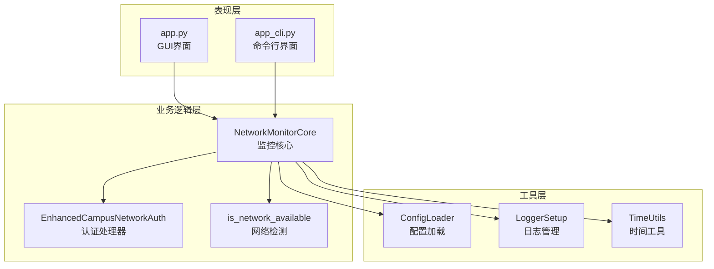

# 🌐 JCU校园网自动认证工具

[](https://www.python.org/downloads/)
[](LICENSE)
[](#支持平台)

> 🚀 基于 Playwright 的校园网自动认证工具，支持 GUI 图形界面和 CLI 命令行双模式操作

## 📋 目录

- [✨ 项目特色](#-项目特色)
- [🎯 核心功能](#-核心功能)
- [🚀 快速开始](#-快速开始)
- [📱 使用指南](#-使用指南)
- [⚙️ 配置说明](#️-配置说明)
- [🏗️ 技术架构](#️-技术架构)
- [🔧 高级配置](#-高级配置)
- [❓ 故障排除](#-故障排除)
- [📄 安全声明](#-安全声明)
- [🤝 贡献指南](#-贡献指南)

## ✨ 项目特色

- 🖥️ **双模式支持**：提供 GUI 图形界面和 CLI 命令行两种使用方式
- 🔄 **智能监控**：自动检测网络状态，断网时自动重新认证
- 🕐 **时段控制**：支持设置暂停登录时间段，避免深夜频繁认证
- 🌙 **后台运行**：支持无头模式和守护进程模式，静默后台运行
- 📊 **实时日志**：详细的运行日志和状态监控
- ⚡ **高性能**：基于 Playwright 浏览器自动化，稳定可靠
- 🛡️ **安全可靠**：本地存储配置，不上传任何敏感信息

## 🎯 核心功能

### 🔐 自动认证功能
- 智能识别多种校园网认证页面
- 支持移动、联通、电信等多运营商
- 自动填写用户名密码并提交认证
- 认证结果智能判断和异常处理

### 📡 网络监控功能
- 定期检测网络连通性（Socket + HTTP 双重验证）
- 网络异常时自动触发重新认证
- 可配置检测间隔时间
- 智能重试机制，避免频繁认证

### 🎮 双模式操作支持
- **GUI 模式**：直观的图形界面，适合日常使用
- **CLI 模式**：命令行操作，支持后台守护进程

### ⏰ 暂停时段设置
- 支持设置夜间暂停登录时间段
- 避免深夜网络波动导致的频繁认证
- 灵活的时间配置，支持跨天设置

## 🚀 快速开始

### 📋 系统要求

- **Python**: 3.10 或更高版本
- **操作系统**: Windows 10+, macOS 10.14+, Ubuntu 18.04+
- **网络**: 校园网环境

### 🔧 安装步骤

#### 方法一：使用 uv（推荐）

```bash
# 1. 克隆项目
git clone https://github.com/Misyra/JCU_auto_network.git
cd JCU_auto_network

# 2. 安装 uv（如果未安装）
# Windows
powershell -c "irm https://astral.sh/uv/install.ps1 | iex"
# macOS/Linux
curl -LsSf https://astral.sh/uv/install.sh | sh

# 3. 安装依赖
uv sync

# 4. 安装 Playwright 浏览器
uv run playwright install chromium
```

#### 方法二：使用 pip

```bash
# 1. 克隆项目
git clone https://github.com/Misyra/JCU_auto_network.git
cd JCU_auto_network

# 2. 创建虚拟环境（推荐）
python -m venv venv

# 激活虚拟环境
# Windows
venv\Scripts\activate
# macOS/Linux
source venv/bin/activate

# 3. 安装依赖
pip install -r requirements.txt

# 4. 安装 Playwright 浏览器
playwright install chromium
```

#### Windows 一键安装

```bash
# 运行 Windows 环境配置脚本
cd install/windows
install.bat
```

### ⚡ 快速启动

#### GUI 模式（推荐新手）

```bash
# 使用 uv
uv run app.py

# 或使用 python
python app.py
```

#### CLI 模式

```bash
# 前台运行
uv run app_cli.py

# 后台守护进程模式
uv run app_cli.py --daemon

# 查看运行状态
uv run app_cli.py --status

# 停止后台服务
uv run app_cli.py --stop
```

## 📱 使用指南

### 🖥️ GUI 模式使用

1. **首次配置**
   - 启动程序后，在登录配置区域填写：
     - 账号：学号 + 运营商后缀（如：123456@cmcc）
     - 密码：校园网登录密码
     - 运营商：选择对应的网络运营商
     - 检测间隔：网络检测频率（分钟）

2. **开始监控**
   - 点击「开始监控」按钮启动自动认证
   - 程序将定期检测网络状态
   - 发现网络异常时自动进行认证

3. **手动操作**
   - 「手动登录」：立即执行一次登录认证
   - 「手动认证」：使用备用认证方式
   - 「网络测试」：测试当前网络连通性
   - 「保存配置」：保存当前配置到文件

4. **监控选项**
   - ☑️ 启动时自动运行：程序启动后自动开始监控
   - ☑️ 后台静默运行：使用无头模式，不显示浏览器窗口
   - ☑️ 暂停登录时段：设置夜间暂停时间，避免频繁认证

### 💻 CLI 模式使用

```bash
# 查看帮助
python app_cli.py --help

# 前台运行（适合调试）
python app_cli.py

# 后台守护进程模式（适合长期运行）
python app_cli.py --daemon

# 查看后台服务状态
python app_cli.py --status

# 停止后台服务
python app_cli.py --stop
```

### 🚀 macOS 系统服务安装

```bash
# 安装为系统启动服务
cd install/mac
./install.sh

# 卸载系统服务
./uninstall.sh
```

## ⚙️ 配置说明

### 📝 配置文件 (.env)

项目使用 `.env` 文件存储配置信息，首次运行会自动创建：

```bash
# 校园网认证配置
CAMPUS_USERNAME=123456@cmcc          # 账号（学号+运营商后缀）
CAMPUS_PASSWORD=your_password        # 密码
CAMPUS_AUTH_URL=http://172.29.0.2   # 认证服务器地址
CAMPUS_ISP=@cmcc                     # 运营商后缀

# 浏览器配置
BROWSER_HEADLESS=false               # 是否无头模式运行
BROWSER_TIMEOUT=10000                # 页面加载超时时间(ms)

# 网络检测配置
MONITOR_INTERVAL=300                 # 检测间隔(秒)
AUTO_START_MONITORING=false          # 启动时自动开始监控

# 暂停登录配置
PAUSE_LOGIN_ENABLED=true             # 是否启用暂停时段
PAUSE_LOGIN_START_HOUR=0             # 暂停开始时间(小时)
PAUSE_LOGIN_END_HOUR=6               # 暂停结束时间(小时)

# 重试配置
MAX_LOGIN_ATTEMPTS=3                 # 最大登录重试次数
LOGIN_COOLDOWN_DURATION=300          # 登录失败冷却时间(秒)

# 日志配置
LOG_LEVEL=INFO                       # 日志级别
LOG_MAX_SIZE=2097152                 # 日志文件最大大小(字节)
LOG_BACKUP_COUNT=5                   # 日志备份文件数量
```

### 🔧 运营商配置

| 运营商 | 后缀代码 | 说明 |
|--------|----------|------|
| 中国移动 | @cmcc | China Mobile |
| 中国联通 | @unicom | China Unicom |
| 中国电信 | @telecom | China Telecom |
| 教育网 | @edu | Education Network |

## 🏗️ 技术架构

### 📁 项目结构

```
JCU_auto_network/
├── src/                     # 核心功能模块
│   ├── campus_login.py      # 校园网认证逻辑
│   ├── network_test.py      # 网络状态检测
│   └── utils.py             # 工具类和配置管理
├── install/                 # 安装脚本
│   ├── mac/                 # macOS 安装脚本
│   │   ├── install.sh       # 系统服务安装
│   │   └── uninstall.sh     # 系统服务卸载
│   └── windows/             # Windows 安装脚本
│       ├── install.bat      # 环境配置脚本
│       └── build_exe.bat    # 程序打包脚本
├── logs/                    # 日志文件目录
├── app.py                   # GUI 主程序
├── app_cli.py               # CLI 主程序
├── pyproject.toml           # 项目配置
├── requirements.txt         # 依赖列表
└── .env                     # 配置文件
```

### 🔄 架构设计



### 🧩 核心组件

- **NetworkMonitorCore**: 监控核心，封装完整的网络监控逻辑
- **EnhancedCampusNetworkAuth**: 基于 Playwright 的认证处理器
- **ConfigLoader**: 统一的配置管理工具
- **LoggerSetup**: 日志系统管理
- **TimeUtils**: 时间相关工具函数

## 🔧 高级配置

### 🎛️ 性能优化

```bash
# 启用低资源模式
BROWSER_LOW_RESOURCE_MODE=true

# 减少检测频率（适合稳定网络）
MONITOR_INTERVAL=600  # 10分钟检测一次

# 启用无头模式（节省资源）
BROWSER_HEADLESS=true
```

### 🔐 安全配置

```bash
# 设置配置文件权限（仅限 Unix 系统）
chmod 600 .env

# 确保敏感信息不被提交到版本控制
echo ".env" >> .gitignore
```

### 📊 日志配置

```bash
# 详细日志（调试用）
LOG_LEVEL=DEBUG

# 生产环境日志
LOG_LEVEL=INFO

# 错误日志
LOG_LEVEL=ERROR
```

## ❓ 故障排除

### 🔧 常见问题

#### 问题1：无法启动浏览器

**症状**：程序报错 "Executable doesn't exist"

**解决方案**：
```bash
# 重新安装 Playwright 浏览器
playwright install chromium

# 或指定浏览器路径
playwright install --help
```

#### 问题2：认证失败

**症状**：显示认证失败或无法访问认证页面

**排查步骤**：
1. 检查网络连接：确保已连接校园网
2. 验证认证地址：确认 `CAMPUS_AUTH_URL` 配置正确
3. 检查账号密码：确认用户名包含正确的运营商后缀
4. 尝试手动登录：使用浏览器手动访问认证页面

#### 问题3：程序无响应

**症状**：GUI 界面卡死或 CLI 无输出

**解决方案**：
```bash
# 检查进程状态
python app_cli.py --status

# 强制停止后台服务
python app_cli.py --stop

# 清理临时文件
rm -f /tmp/campus_auth_*.pid
```

#### 问题4：日志文件过大

**症状**：logs 目录占用空间过大

**解决方案**：
```bash
# 清理旧日志
rm -f logs/*.log.*

# 调整日志配置
# 在 .env 文件中设置
LOG_MAX_SIZE=1048576      # 1MB
LOG_BACKUP_COUNT=3        # 保留3个备份
```

### 🐛 调试模式

```bash
# 启用详细日志
export LOG_LEVEL=DEBUG

# 关闭无头模式（可以看到浏览器操作）
export BROWSER_HEADLESS=false

# 运行程序
python app.py
```

### 📞 获取帮助

如果遇到无法解决的问题：

1. 📋 检查日志文件：`logs/campus_auth.log`
2. 🐛 提交 Issue：[GitHub Issues](https://github.com/Misyra/JCU_auto_network/issues)
3. 📖 查看文档：项目 Wiki 页面

## 📄 安全声明

### ⚠️ 重要声明

1. **合法使用**: 本工具仅供学习和研究使用，请遵守学校网络使用规定
2. **数据安全**: 所有配置信息均存储在本地，不会上传到任何服务器
3. **开源透明**: 项目完全开源，欢迎审查代码安全性
4. **责任免责**: 使用本工具产生的任何问题由用户自行承担

### 🛡️ 隐私保护

- ✅ 密码仅保存在本地 `.env` 文件中
- ✅ 不收集任何用户个人信息
- ✅ 不向第三方服务器发送数据
- ✅ 支持配置文件加密存储

## 🤝 贡献指南

### 💡 如何贡献

1. **Fork 项目**
2. **创建特性分支**: `git checkout -b feature/AmazingFeature`
3. **提交更改**: `git commit -m 'Add some AmazingFeature'`
4. **推送分支**: `git push origin feature/AmazingFeature`
5. **提交 Pull Request**

### 🐛 Bug 报告

提交 Bug 时请包含：
- 操作系统和版本
- Python 版本
- 错误信息和日志
- 复现步骤

### ✨ 功能建议

欢迎提交功能建议和改进意见！

---

## 📊 支持平台

| 平台 | GUI | CLI | 服务模式 |
|------|-----|-----|----------|
| Windows 10+ | ✅ | ✅ | ✅ |
| macOS 10.14+ | ✅ | ✅ | ✅ |
| Ubuntu 18.04+ | ✅ | ✅ | ✅ |
| CentOS 7+ | ❌ | ✅ | ✅ |

## 📈 版本历史

- **v1.0.0** - 初始版本，支持基本认证功能
- **v1.1.0** - 添加 GUI 界面和配置管理
- **v1.2.0** - 增加暂停时段和性能优化
- **v1.3.0** - 支持多平台部署和系统服务

## 📄 许可证

本项目采用 MIT 许可证 - 详见 [LICENSE](LICENSE) 文件

## 🙏 致谢

- [Playwright](https://playwright.dev/) - 浏览器自动化框架
- [python-dotenv](https://github.com/theskumar/python-dotenv) - 环境变量管理
- [tkinter](https://docs.python.org/3/library/tkinter.html) - GUI 界面框架

---

<div align="center">

**⭐ 如果这个项目对你有帮助，请给个 Star！⭐**

[报告 Bug](https://github.com/Misyra/JCU_auto_network/issues) · [功能建议](https://github.com/Misyra/JCU_auto_network/issues) · [贡献代码](https://github.com/Misyra/JCU_auto_network/pulls)

</div>
